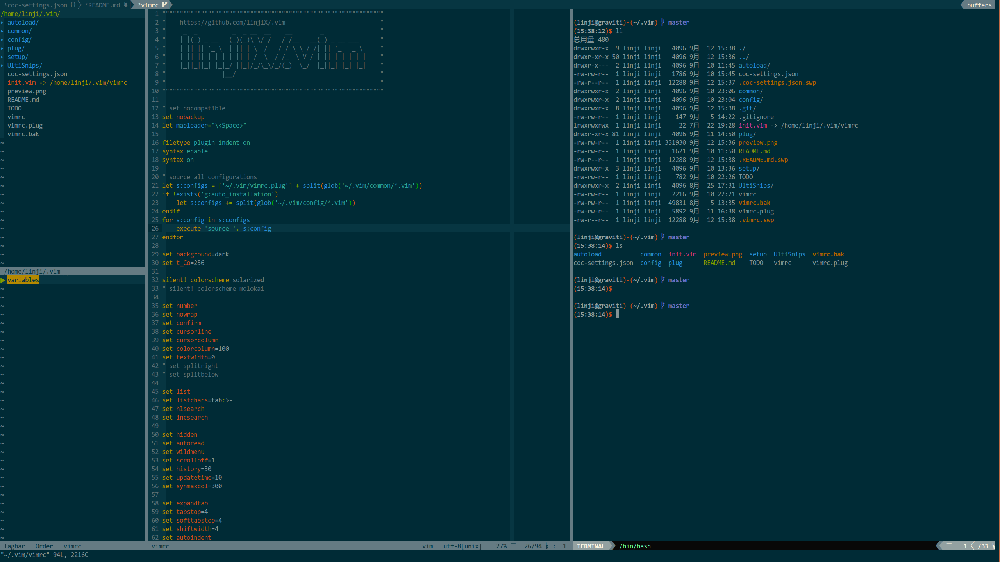

# .vim



## Installation (Ubuntu 16.04 & 20.04)

```bash
curl -sS https://raw.githubusercontent.com/linjiX/.vim/master/setup/setup.sh | bash
```

It will take a long time, make sure your network is unblocked and be patient.

## Fonts

Vim may meet some display issues in your machine.  
The reason is your terminal font doesn't support powerline or nerd-fonts.  
Here is a recommended font: <https://github.com/linjiX/Consolas-with-Yahei>

```bash
# For Ubuntu
mkdir -p ~/.local/share/fonts
git clone --depth=1 https://github.com/linjiX/Consolas-with-Yahei.git
cp Consolas-with-Yahei/ttf/* ~/.local/share/fonts/
```

Then enable it in your terminal.

---

#### Select a colorscheme for yourself, then enjoy your Vim!

---

## How to update

```bash
cd ~/.vim
git pull
vim ~/.vim/vimrc.plug
:PlugUpdate
:CocUpdateSync
:qa
```

## Language Support

The language format and static check feature needs external tools  
Here is how to install them:

-   [Ubuntu 16.04](setup/README_xenial.md)
-   [Ubuntu 20.04](setup/README_focal.md)
-   [MacOS](setup/README_macos.md)
